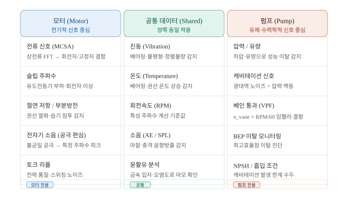
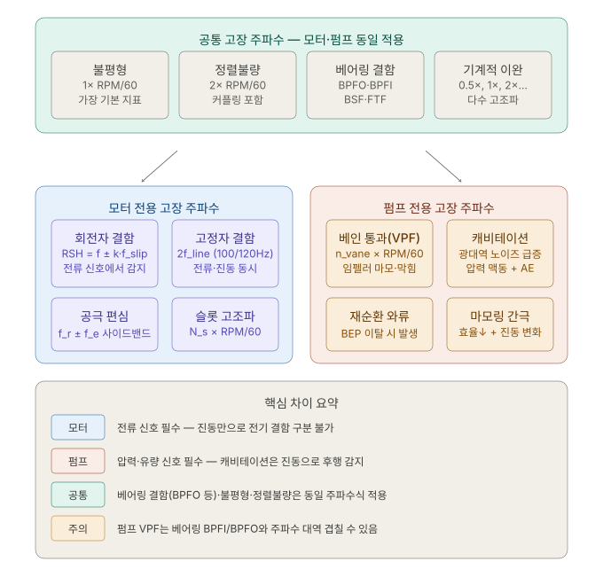

# 예지보전: 모터 vs 펌프 데이터 비교

## 개요

모터와 펌프는 둘 다 회전기계이지만, PdM(Predictive Maintenance) 관점에서 수집하는 데이터와 해석 방식에 중요한 차이가 있습니다. 핵심은 **"무엇을 추가로 봐야 하는가"** 에 있습니다.

---

## 데이터 소스 비교



---

## 고장 특성 주파수 비교



---

## 공통점 (Similarities)

모터와 펌프는 모두 **회전기계**이므로 아래 데이터와 고장 패턴을 동일하게 공유합니다.

### 공통 센서 데이터
| 데이터 | 설명 |
|--------|------|
| 진동 (Vibration) | 가속도계 — 베어링·불평형·정렬불량 감지 |
| 온도 (Temperature) | 베어링·권선·유체 온도 상승 감지 |
| 회전속도 (RPM) | 특성 주파수 계산의 기준값 |
| 소음 (AE / SPL) | 음향방출(AE)로 마찰·충격 감지 |
| 윤활유 분석 | 금속 입자·오염도로 마모 상태 확인 |

### 공통 고장 주파수
| 고장 유형 | 주파수 | 비고 |
|-----------|--------|------|
| 불평형 (Imbalance) | 1× RPM/60 | 가장 기본적인 지표 |
| 정렬불량 (Misalignment) | 2× RPM/60 | 커플링 포함 |
| 베어링 결함 | BPFO, BPFI, BSF, FTF | 기하학적 파라미터로 계산 |
| 기계적 이완 (Looseness) | 0.5×, 1×, 2×, 3×… | 다수의 고조파 동시 발생 |

> 베어링 결함 주파수 공식은 모터·펌프 구분 없이 동일하게 적용됩니다.

---

## 차이점 (Differences)

### 모터 전용 데이터 및 고장 주파수

모터는 **전류 신호(MCSA, Motor Current Signature Analysis)** 가 핵심 추가 채널입니다.  
회전자 단선, 고정자 권선 단락, 공극 편심 같은 **전기적 결함**은 진동 신호만으로는 감지가 어렵거나 너무 늦게 나타납니다.

| 고장 유형 | 특성 주파수 | 감지 채널 |
|-----------|------------|-----------|
| 회전자 결함 (RSH) | `f ± k × f_slip` | 전류 신호 |
| 고정자 결함 | `2 × f_line` (100 / 120 Hz) | 전류 + 진동 |
| 공극 편심 | `f_r ± f_e` 사이드밴드 | 전류 신호 |
| 슬롯 고조파 | `N_s × RPM/60` | 진동 |
| 토크 리플 | 전력 품질 주파수 | 전류 + 진동 |
| 절연 저항 / 부분방전 | — (비주기적) | 절연 저항계 / PD 센서 |

> `f_slip = f_line × (1 - 회전수/동기속도)` — 슬립 주파수를 기준으로 사이드밴드를 분석하는 것이 모터 PdM의 핵심 기술입니다.

---

### 펌프 전용 데이터 및 고장 주파수

펌프는 **압력·유량 신호(수력학적 신호)** 가 핵심 추가 채널입니다.  
캐비테이션은 진동으로도 감지되지만, 압력 맥동이 훨씬 먼저 더 명확하게 나타납니다.

| 고장 유형 | 특성 주파수 / 지표 | 감지 채널 |
|-----------|-------------------|-----------|
| 베인 통과 (VPF) | `n_vane × RPM/60` | 진동 + 압력 |
| 캐비테이션 | 광대역 고주파 노이즈 | 진동 + 압력 + AE |
| 재순환 와류 | BEP 이탈 시 저주파 맥동 | 압력·유량 |
| 마모링 간극 | 효율 저하 + 진동 변화 | 유량 + 진동 |
| NPSH 부족 | — (유체 조건) | 흡입 압력계 |

> BEP(Best Efficiency Point) 이탈 여부는 **유량-양정 곡선(H-Q curve)** 을 실시간으로 비교해야만 알 수 있어, 진동 신호만으로는 판별이 어렵습니다.

---

## 주요 주의사항

### VPF와 베어링 주파수 혼동 위험

펌프의 **베인 통과 주파수(VPF)**는 베어링 결함 주파수(BPFI, BPFO)와 대역이 겹칠 수 있습니다.

```
예시 (6베인 펌프, 1800 RPM):
VPF = 6 × (1800/60) = 180 Hz

BPFI (6204 베어링 기준) ≈ 162 Hz
→ 대역 근접 → 오진단 위험!
```

해결책: **위상(phase) 분석**과 **사이드밴드 패턴**으로 구분합니다. BPFI는 1× RPM 간격의 사이드밴드를 동반하지만, VPF는 그렇지 않습니다.

---

## ML 모델 설계 시 시사점

| 항목 | 모터 | 펌프 |
|------|------|------|
| 필수 피처 | 전류 스펙트럼 (MCSA), f_slip 기반 사이드밴드 | 압력 맥동, 유량 편차, VPF |
| 공통 피처 | RMS, Kurtosis, Skewness, BPFO/BPFI 에너지 | RMS, Kurtosis, Skewness, BPFO/BPFI 에너지 |
| 이상 탐지 특이사항 | 전기 결함은 기계 결함보다 초기 진폭 변화 작음 | 캐비테이션은 압력 신호가 진동보다 선행 감지 |
| CWRU 데이터셋 | 직접 적용 가능 (베어링 중심) | VPF·캐비테이션 피처 별도 설계 필요 |
