# 주파수 정의와 모터 예지보전에서 주파수 분석의 중요성

## 주파수란?

**주파수(Frequency)**는 단위 시간(1초) 동안 반복되는 진동 또는 주기적 사건의 횟수로, 단위는 **Hz (Hertz)** 입니다.

$$f = \frac{1}{T}, \quad T : \text{주기(period)}$$

진동 신호는 시간 영역(Time domain)에서는 복잡하게 얽혀 보이지만, **푸리에 변환(FFT)** 을 통해 주파수 영역(Frequency domain)으로 변환하면 각 성분 주파수의 에너지(크기)로 분해됩니다. 이것이 주파수 분석의 핵심입니다.

---

## 개념 다이어그램



---

## 왜 모터 예지보전에서 주파수 분석이 중요한가

모터와 회전기계에는 **각 고장 유형마다 물리적으로 발생하는 특정 주파수**가 있습니다.  
고장이 진행될수록 해당 주파수의 진폭(amplitude)이 커집니다.  
즉, 진폭 변화를 추적하면 고장을 사전에 감지할 수 있습니다.

---

## 주요 고장 특성 주파수 (Fault Characteristic Frequencies)

### 불평형 (Imbalance)
- **특성 주파수**: `f = 1× RPM/60`
- 회전 주파수의 정수배에서 피크 발생

### 축 정렬불량 (Misalignment)
- **특성 주파수**: `f = 2× RPM/60`
- 2배 주파수가 지배적으로 나타남

### 기계적 이완 (Looseness)
- **특성 주파수**: `f = 0.5×, 1×, 2×, 3×…`
- 다수의 고조파(harmonics) 동시 발생

---

## 베어링 결함 (Bearing Fault) — 가장 중요

베어링 기하학적 파라미터(볼 수 `n`, 볼 직경 `Bd`, 피치경 `Pd`, 접촉각 `θ`)와 회전속도만 알면 아래 특성 주파수를 수학적으로 계산할 수 있습니다.

| 약어 | 결함 위치 | 계산식 |
|------|-----------|--------|
| **BPFO** | 외륜 (Outer Race) | `n/2 × f × (1 - Bd/Pd × cosθ)` |
| **BPFI** | 내륜 (Inner Race) | `n/2 × f × (1 + Bd/Pd × cosθ)` |
| **BSF**  | 볼 스핀 (Ball Spin) | `Pd/(2Bd) × f × (1 - (Bd/Pd)²)` |
| **FTF**  | 케이지 (Cage) | `f/2 × (1 - Bd/Pd × cosθ)` |

> `f` = 회전 주파수 (Hz) = RPM / 60

---

## 고장 진전 단계별 주파수 특성 변화

| 단계 | 상태 | 주파수 특성 |
|------|------|-------------|
| **Stage 1** (초기) | 정상 → 미세 결함 | 고주파 대역(HFR) 노이즈 증가 시작 |
| **Stage 2** (중기) | 결함 성장 | BPFO/BPFI 등 특성 주파수 출현, 사이드밴드 발생 |
| **Stage 3** (심화) | 명확한 결함 | 1×, 2×, 3× 고조파 출현, 진폭 급격히 증가 |
| **Stage 4** (말기) | 위험 | 광대역 노이즈 플로어 상승, 특성 주파수 구분 불가 |

---

## 주파수 분석이 핵심인 이유 3가지

### 1. 고장 유형 식별
진폭(RMS, Peak)만으로는 "이상이 있다"는 것만 알 수 있습니다.  
주파수 패턴을 분석하면 **불평형인지, 베어링 결함인지, 정렬불량인지** 구체적으로 구분할 수 있습니다.

### 2. 조기 감지
육안이나 소리로 이상을 감지하기 수 주~수 개월 전부터 특성 주파수 성분이 주파수 스펙트럼에서 검출됩니다.  
이를 통해 계획 정비(Planned Maintenance)가 가능해집니다.

### 3. 심각도 정량화 및 RUL 예측
특성 주파수별 진폭 추이를 시계열로 모니터링하면 고장 진전 속도를 파악하고 **잔여 수명(RUL, Remaining Useful Life)** 을 예측할 수 있습니다.

---

## 사이드밴드(Sideband)의 의미

특성 주파수 양쪽으로 회전 주파수 간격의 사이드밴드가 생기면 결함이 진전되고 있다는 신호입니다.  
사이드밴드의 수와 크기로 심각도를 판단합니다.

```
스펙트럼 예시:

진폭
 |         BPFI
 |          |
 |     *    |    *        ← 사이드밴드 (±1× 간격)
 |          |
 |__________|_________________________  주파수(Hz)
          BPFI   BPFI±1×RPM
```

---

## CWRU 데이터셋과의 연결

CWRU Bearing Dataset의 각 레이블은 다음 특성 주파수와 대응됩니다:

| 레이블 | 결함 위치 | 지배 주파수 |
|--------|-----------|-------------|
| `B007`, `B014`, `B021` | 볼 결함 | BSF |
| `IR007`, `IR014`, `IR021` | 내륜 결함 | BPFI |
| `OR007`, `OR014`, `OR021` | 외륜 결함 | BPFO |
| `Normal` | 정상 | 특성 주파수 없음 |

Isolation Forest / XGBoost / LSTM Autoencoder가 학습하는 피처들 — 예를 들어 RMS, Kurtosis, Skewness, 주파수 대역별 에너지 비율 — 은 결국 이 주파수 성분의 **에너지 분포 변화**를 다양한 각도에서 포착한 것입니다.

따라서 신호 처리 단계에서 FFT 기반의 주파수 도메인 피처를 추가하면 모델 성능을 더욱 높일 수 있습니다.
